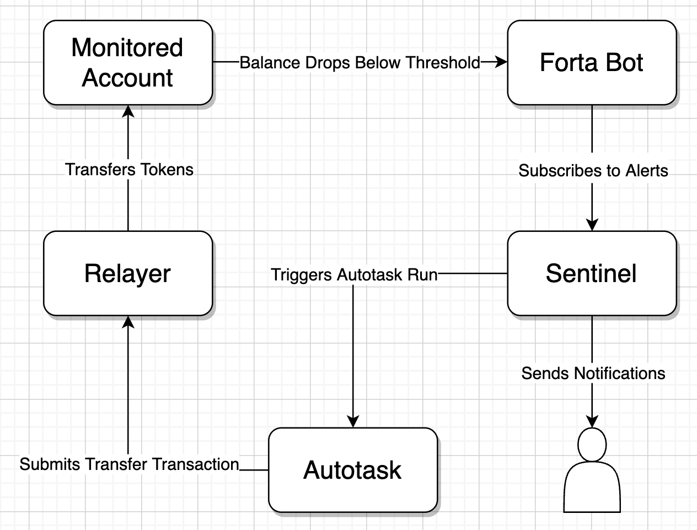

# Automate ERC20 Token Balance Maintenance Using A Forta Bot and Defender Autotask

Example repo to demonstrate automated smart contract balance maintenance.

## Components

- [OpenZeppelin Defender](https://defender.openzeppelin.com)
- [Forta](https://forta.network)

Create a Forta bot to monitor a given account and issue an alert if the account balance drops below 0.1. The alert is subscribed to via a Defender Sentinel, which sends an alert notification via Telegram and triggers an Autotask to transfer funds from a Relayer to the account being monitored by the Forta bot.

## Resources

- [Walkthrough Guide - Defender Docs](https://docs.openzeppelin.com/defender/guide-balance-automation-forta-sentinel)
